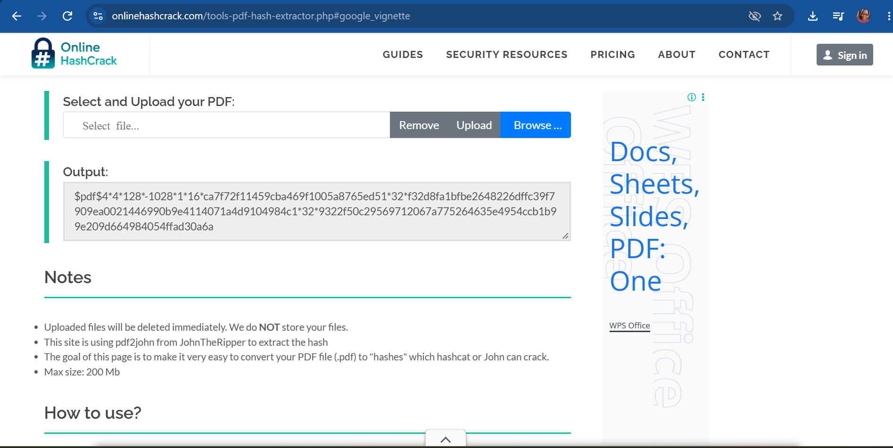
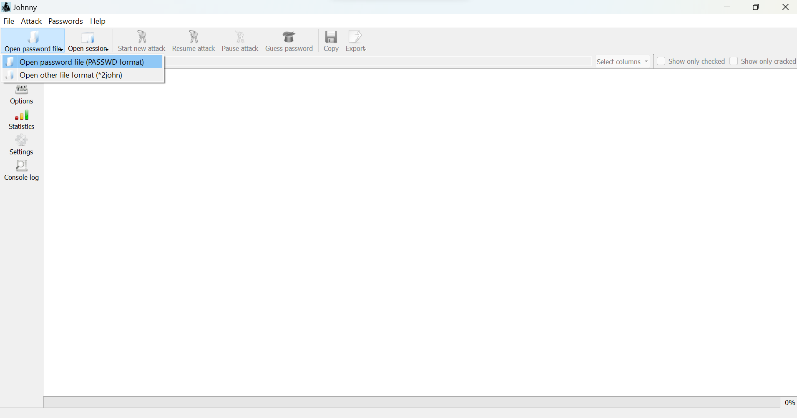
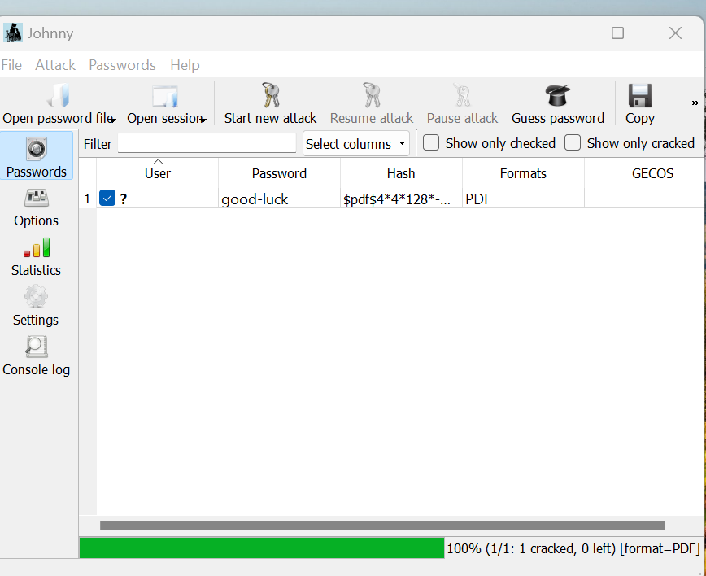
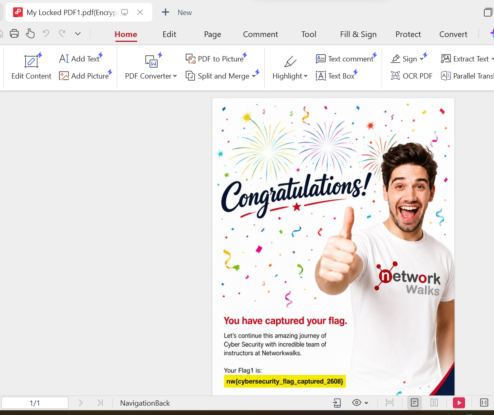
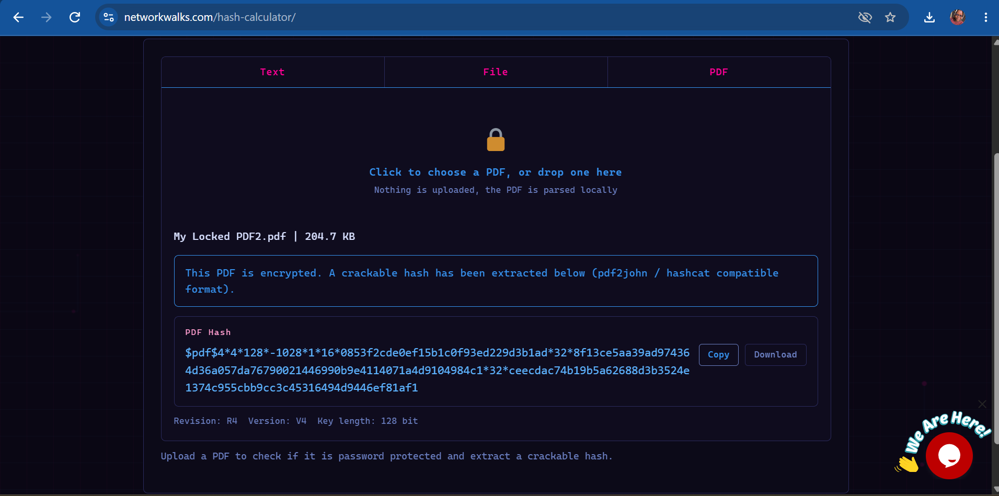
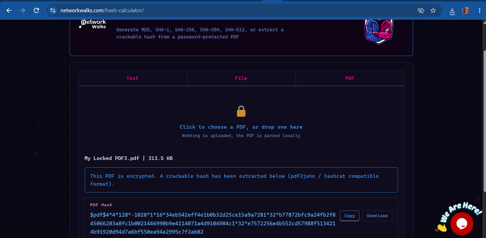

# NETWORKWALKS-B083A-WK3-PM3-PASSWORD-CRACKING

# PASSWORD CRACKING REPORT
## PASSWORD CRACKING WITH JTR, JTR JOHNNY & NETWORKWALKS TOOLS

## 1. Liability Disclaimer
This exercise was performed on a file provided specifically for an authorized educational cybersecurity lab as part of the NetworkWalks internship program. No real world systems or files were accessed without permission.
## 2. Introduction
This report covers password cracking using John the Ripper (JTR), JTR Johnny and NetworkWalks tools. JTR is a very popular password cracking tool used by cybersecurity professionals to test how strong and secure passwords are. It checks many types of password hashes and can also unlock password protected files like PDF, ZIP, and Office documents.

In this lab JTR John and JTR Johnny were used to recover the password of a protected PDF file. The exercise helped to learn how password cracking works and why it is important to use strong passwords for a better protection.

Also, NetworkWalks Hash Calculator and Password Cracker were used to open locked pdf files.
## 3. Objective
* To crack the passwords of locked PDF files using JTR John and Johnny GUI, NetworkWalks tools on Windows.
## 4. Tools Used 
This table lists each tools used in this project and also its purpose in the project.
| Tool | Purpose |
|------|---------|
| John the Ripper (Jumbo build) | Core password cracking engine that runs the actual attack against the extracted hash |
| Johnny GUI | Graphical frontend for John the Ripper, allowing hash loading and attack control without command line syntax |
| NetworkWalks Hash Calculator | Converts the locked PDF into a crackable hash format |
| NetworkWalks Password Cracker | Used to recover the password from the extracted hash |
| Notepad | Used to save the extracted hash as a `.txt` file in the correct format for Johnny to read |

# 5. Activities Performed 
## 5.1 Password Cracking with JTR & Johnny GUI
I downloaded the locked PDF files provided and opened Online Hash Crack in my web browser. The locked PDF was uploaded on online hash crack and the hash file was generated.

The hash value displayed above was copied and pasted on my notepad. I saved it as a `.txt`for easy access and opened JTR app. I clicked on the open password file and uploaded the `hash.txt` then I started the attack. JTR cracked the password and displayed it. I copied the password and was able to open the PDF file.

## 5.2 Password Cracking with NetworkWalks Tools
I opened NetworkWalks Hash Calculator on my web browser and I uploaded the locked PDF file. The hash calculator generated the hash value for the PDF file.

